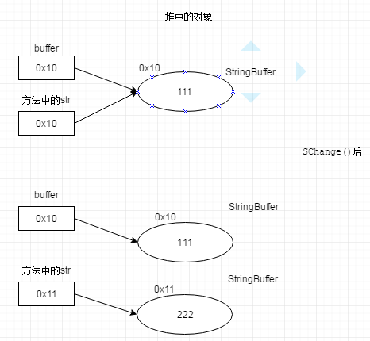
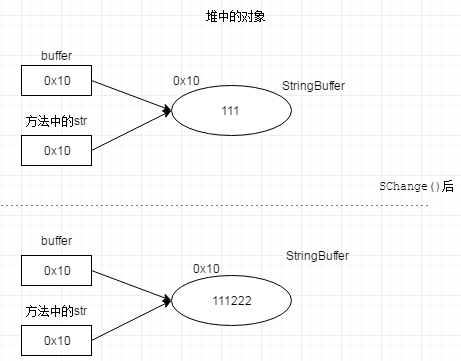

# 概念

值传递和引用传递，属于函数调用时参数的 **求值策略**(Evaluation Strategy)，这是对调用函数时，**求值和传值的方式的描述**，而非传递的内容的类型（内容指：是值类型还是引用类型，是值还是指针）

change 改变变量指向的内存地址
mutate 改变变量指向的内存地址里的value


| 求值策略 | 求值时间 | 传值方式 |
|:-------------:|:-------------:|:-------------:|
| 值传递(pass by value) | 调用前 | 值的结果(原值的副本) |
| 引用传递(pass by reference) | 调用前 | 原值(原始对象，无副本) |  
| 名传递(pass by name) | 调用后(用到才求值) | 与值无关的一个名 |

|  | 值传递 | 引用传递 |
|:-------------:|:-------------:|:-------------:|
| 根本区别 | 创建副本 | 不创建副本 |  
| 所以 | 函数中无法**改变原始对象** | 可以改变原始对象 |  

这里的改变不是指mutate, 而是change

对于值传递，无论是值类型还是引用类型，都会在调用栈上创建一个副本，不同是，对于值类型而言，这个副本就是整个原始值的复制。而对于引用类型而言，由于引用类型的实例在堆中，在栈上只有它的一个引用（一般情况下是指针），其副本也只是这个引用的复制，而不是整个原始对象的复制。


```
public class Test {
    public static void main(String[] args) {
        StringBuffer buffer= new StringBuffer("111");
        SChange(buffer);
        System.out.println( buffer);
    }

    public static void SChange (StringBuffer str) {
        str= new StringBuffer("222");
    }
}
```

输出为111



```
public static void main(String[] args) {
        StringBuffer buffer= new StringBuffer("111");
        SChange(buffer);
        System.out.println( buffer);
    }

    public static void SChange (StringBuffer str) {
        str.append("222");
    }
```

输出为111222



#
