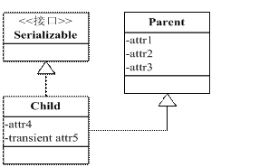

[TOC]

# 概念和作用

Java序列化是指把Java对象转换为字节序列的过程
Java反序列化是指把字节序列恢复为Java对象的过程

* 实现了数据的持久化，通过序列化可以把数据永久地保存到硬盘上
* 可以实现远程通信

# 保存到磁盘上（或网络传输）的对象文件

里面包括两部分

* 类描述信息

  包括包路径、继承关系、访问权限、变量描述、变量访问权限、方法签名、返回值已经变量的关联类信息。它 **并不是class文件的翻版** 它不记录方法、构造函数、static变量的具体实现。
* 非瞬态（transient关键字）和非静态（static关键字）的实例变量值

  如果是基本类型，直接用简单值保持，如果是复杂对象，则该对象和关联类信息一起保持，并且持续递归下去，**到最后，还是基本数据类型的保存**

# 步骤

序列化：
* 创建一个对象输出流，它可以包装一个其它类型的目标输出流，如文件输出流
* 通过对象输出流的writeObject()方法写对象

反序列化：
* 创建一个对象输入流，它可以包装一个其它类型输入流，如文件输入流：
* 通过对象输出流的readObject()方法读取对象：

```java
Student st = new Student("Tom",'M',20,3.6);  
  File file = new File("O:\\Java\\com\\jieke\\io\\student.txt");  
  try  
  {  
   file.createNewFile();  
  }  
  catch(IOException e)  
  {  
   e.printStackTrace();  
  }  
  try  
  {  
   //Student对象序列化过程  
   FileOutputStream fos = new FileOutputStream(file);  
   ObjectOutputStream oos = new ObjectOutputStream(fos);  
   oos.writeObject(st);  
   oos.flush();  
   oos.close();  
   fos.close();  

   //Student对象反序列化过程  
   FileInputStream fis = new FileInputStream(file);  
   ObjectInputStream ois = new ObjectInputStream(fis);  
   Student st1 = (Student) ois.readObject();  
   System.out.println("name = " + st1.getName());  
   System.out.println("sex = " + st1.getSex());  
   System.out.println("year = " + st1.getYear());  
   System.out.println("gpa = " + st1.getGpa());  
   ois.close();  
   fis.close();  
  }  
  catch(ClassNotFoundException e)  
  {  
   e.printStackTrace();  
  }  
  catch (IOException e)  
  {  
   e.printStackTrace();  
  }               
 }  
}  
```

# 注意事项

## 序列号ID

序列化 ID 在 Eclipse 下提供了两种生成策略，
* 一个是固定的 1L，
* 一个是随机生成一个不重复的 long 类型数据

**如果序列号ID不同，则不能互序列化和反序列化。** 即使两个类其他代码完全相同。

如果没有特殊需求，就是用默认的 1L 就可以，这样可以确保代码一致时反序列化成功。
有些时候，通过改变序列化 ID 可以用来限制某些用户的使用。

## 序列化不保存静态变量

序列化保存的是对象的状态，静态变量属于类的状态，因此 序列化并不保存静态变量。

反序列化后类中static型变量的值为当前JVM中对应static变量的值，这个值是JVM中的 **不是反序列化得出的**

## 默认序列化机制

如果仅仅只是让某个类实现Serializable接口，而没有其它任何处理的话，则就是使用默认序列化机制。使用默认机制，在序列化对象时，不仅会序列化当前对象本身，还会对该对象引用的其它对象也进行序列化，同样地，这些其它对象引用的另外对象也将被序列化，以此类推。所以，如果一个对象包含的成员变量是容器类对象，而这些容器所含有的元素也是容器类对象，那么这个序列化的过程就会较复杂，开销也较大。

## 序列化复杂情况

* 如果序列化的属性是对象，这个对象也必须实现Serializable接口，否则会报错
* 在反序列化时，如果对象的属性有修改或删减，修改的部分属性会丢失，但不会报错
* 在反序列化时，如果serialVersionUID被修改，那么反序列化时会失败


## 父类的序列化

当父类实现了 Serializable 接口，所有子类都可以序列化

子类实现了 Serializable 接口，它的父类都没有实现 Serializable 接口，父类的属性不能序列化（数据会丢失），但是子类中的属性仍能正确序列化。

情境：一个子类实现了 Serializable 接口，它的父类都没有实现 Serializable 接口，序列化该子类对象，然后反序列化后输出父类定义的某变量的数值，该变量数值与序列化时的数值不同。

　解决：要想将父类对象也序列化，就需要让父类也实现Serializable 接口。如果父类不实现的话的，就需要有默认的无参的构造函数。 在父类没有实现 Serializable 接口时，虚拟机是不会序列化父对象的，而一个 Java 对象的构造必须先有父对象，才有子对象，反序列化也不例外。所以反序列化时，为了构造父对象，只能调用父类的无参构造函数作为默认的父对象。因此当我们取 父对象的变量值时，它的值是调用父类无参构造函数后的值。如果你考虑到这种序列化的情况，在父类无参构造函数中对变量进行初始化，否则的话，父类变量值都 是默认声明的值，如 int 型的默认是 0，string 型的默认是 null。

Transient 关键字的作用是控制变量的序列化，在变量声明前加上该关键字，可以阻止该变量被序列化到文件中，在被反序列化后，transient 变量的值被设为初始值，如 int 型的是 0，对象型的是 null。

**特性使用案例**

们熟悉使用 Transient 关键字可以使得字段不被序列化，那么还有别的方法吗？根据父类对象序列化的规则，我们可以将不需要被序列化的字段抽取出来放到父类中，子类实现 Serializable 接口，父类不实现，根据父类序列化规则，父类的字段数据将不被序列化，形成类图如图 2 所示。



上图中可以看出，attr1、attr2、attr3、attr5 都不会被序列化，放在父类中的好处在于当有另外一个 Child 类时，attr1、attr2、attr3 依然不会被序列化，不用重复抒写 transient，代码简洁。

对敏感字段加密

情境：服务器端给客户端发送序列化对象数据，对象中有一些数据是敏感的，比如密码字符串等，希望对该密码字段在序列化时，进行加密，而客户端如果拥有解密的密钥，只有在客户端进行反序列化时，才可以对密码进行读取，这样可以一定程度保证序列化对象的数据安全。

解决： 在序列化过程中，虚拟机会试图调用对象类里的 writeObject 和 readObject 方法，进行用户自定义的序列化和反序列化，如果没有这样的方法，则默认调用是 ObjectOutputStream 的 defaultWriteObject 方法以及 ObjectInputStream 的 defaultReadObject 方法。用户自定义的 writeObject 和 readObject 方法可以允许用户控制序列化的过程，比如可以在序列化的过程中动态改变序列化的数值。基于这个原理，可以在实际应用中得到使用，用于敏感字段的加密工作.

```java
private static final long serialVersionUID = 1L;
private String password = "pass";
public String getPassword() {
    return password;
}
public void setPassword(String password) {
    this.password = password;
}

private void writeObject(ObjectOutputStream out) {
    try {
        PutField putFields = out.putFields();
        System.out.println("原密码:" + password);
        password = "encryption";//模拟加密
        putFields.put("password", password);
        System.out.println("加密后的密码" + password);
        out.writeFields();
    } catch (IOException e) {
        e.printStackTrace();
    }
}

private void readObject(ObjectInputStream in) {
    try {
        GetField readFields = in.readFields();
        Object object = readFields.get("password", "");
        System.out.println("要解密的字符串:" + object.toString());
        password = "pass";//模拟解密,需要获得本地的密钥
    } catch (IOException e) {
        e.printStackTrace();
    } catch (ClassNotFoundException e) {
        e.printStackTrace();
    }

}

public static void main(String[] args) {
    try {
        ObjectOutputStream out = new ObjectOutputStream(
                new FileOutputStream("result.obj"));
        out.writeObject(new Test());
        out.close();

        ObjectInputStream oin = new ObjectInputStream(new FileInputStream(
                "result.obj"));
        Test t = (Test) oin.readObject();
        System.out.println("解密后的字符串:" + t.getPassword());
        oin.close();
    } catch (FileNotFoundException e) {
        e.printStackTrace();
    } catch (IOException e) {
        e.printStackTrace();
    } catch (ClassNotFoundException e) {
        e.printStackTrace();
    }
}    

```
特性使用案例

RMI 技术是完全基于 Java 序列化技术的，服务器端接口调用所需要的参数对象来至于客户端，它们通过网络相互传输。这就涉及 RMI 的安全传输的问题。一些敏感的字段，如用户名密码（用户登录时需要对密码进行传输），我们希望对其进行加密，这时，就可以采用本节介绍的方法在客户端对密 码进行加密，服务器端进行解密，确保数据传输的安全性。

## 序列化存储规则

```Java
ObjectOutputStream out = new ObjectOutputStream(
                   new FileOutputStream("result.obj"));
   Test test = new Test();
   //试图将对象两次写入文件
   out.writeObject(test);
   out.flush();
   System.out.println(new File("result.obj").length());
   out.writeObject(test);
   out.close();
   System.out.println(new File("result.obj").length());

   ObjectInputStream oin = new ObjectInputStream(new FileInputStream(
           "result.obj"));
   //从文件依次读出两个文件
   Test t1 = (Test) oin.readObject();
   Test t2 = (Test) oin.readObject();
   oin.close();

   //判断两个引用是否指向同一个对象
   System.out.println(t1 == t2);

```

对同一对象两次写入文件，打印出写入一次对象后的存储大小和写入两次后的存储大小，然后从文件中反序列化出两个对象，比较这两个对象是否为同一对象。一 般的思维是，两次写入对象，文件大小会变为两倍的大小，反序列化时，由于从文件读取，生成了两个对象，判断相等时应该是输入 false 才对，

我们看到，第二次写入对象时文件只增加了 5 字节，并且两个对象是相等的，这是为什么呢？

　　解答：Java 序列化机制为了节省磁盘空间，具有特定的存储规则，当写入文件的为同一对象时，并不会再将对象的内容进行存储，而只是再次存储一份引用，上面增加的 5 字节的存储空间就是新增引用和一些控制信息的空间。反序列化时，恢复引用关系，使得清单 3 中的 t1 和 t2 指向唯一的对象，二者相等，输出 true。该存储规则极大的节省了存储空间。

特性案例分析

```Java
ObjectOutputStream out = new ObjectOutputStream(new FileOutputStream("result.obj"));
Test test = new Test();
test.i = 1;
out.writeObject(test);
out.flush();
test.i = 2;
out.writeObject(test);
out.close();
ObjectInputStream oin = new ObjectInputStream(new FileInputStream(
                    "result.obj"));
Test t1 = (Test) oin.readObject();
Test t2 = (Test) oin.readObject();
System.out.println(t1.i);
System.out.println(t2.i);
```

目的是希望将 test 对象两次保存到 result.obj 文件中，写入一次以后修改对象属性值再次保存第二次，然后从 result.obj 中再依次读出两个对象，输出这两个对象的 i 属性值。案例代码的目的原本是希望一次性传输对象修改前后的状态。

　　结果两个输出的都是 1， 原因就是第一次写入对象以后，第二次再试图写的时候，虚拟机根据引用关系知道已经有一个相同对象已经写入文件，因此只保存第二次写的引用，所以读取时，都是第一次保存的对象。读者在使用一个文件多次 writeObject 需要特别注意这个问题。

## 反序列化时final不会被重新赋值的情况

如果final属性是一个 **直接量** ，在反序列化时就会 **重新计算**.

下面几种情况则不会重新赋值.这样会导致当类的版本变更后,final属性被修改了的话,反序列化出来的对象的final属性还是序列化版本的值,也就是上个版本的旧值.

### 在序列化类中，不要使用构造函数为final变量赋值

但是因为 **反序列化时构造函数不会执行** 所以如果用构造函数赋值时会出现问题。比如如果在构造函数中为final重新赋值，反序列化时JVM从数据流获取一个Object对象，然后根据数据流中的类文件描述信息（序列化时，保存到磁盘的对象文件中包含了类描述信息，注意是类描述信息，不是类）查看，发现是final变量，需要重新计算。于是引用Person类中的值，但该变量没有赋值，不能引用，所以它就不再初始化， **保持原值** 即序列化时该final变量的值

### 使用方法返回值为final变量赋值

这是由于保存到磁盘上（或网络传输）的对象文件和class文件并不是完全相同导致的,因为对象文件不记录方法、构造函数、static变量等的具体实现。(见上面的"保存到磁盘上（或网络传输）的对象文件")

### final修饰的属性不是基本类型

这是由于保存到磁盘上（或网络传输）的对象文件和class文件并不是完全相同导致的
