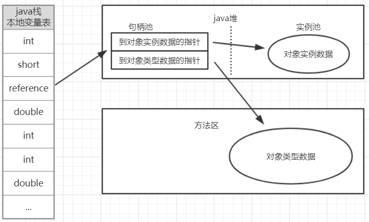
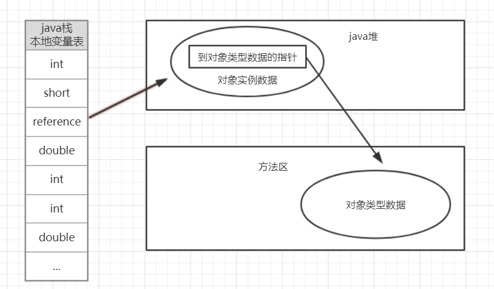

# 对象访问定位

Java程序需要通过栈上的引用数据来操作堆上的具体对象

对象的访问方式取决于虚拟机实现，目前主流的访问方式有

* 句柄
* 直接指针

## 句柄

Java堆中划分出一块内存来作为句柄池，引用中存储对象的句柄地址，而句柄中包含了对象实例数据与类型数据各自的具体地址信息。

### 优点

最大好处就是reference中存储的是稳定的句柄地址，在对象被移动（垃圾收集时移动对象是非常普遍的行为）时只会改变句柄中的实例数据指针，而reference本身不需要修改

## 直接指针(Sun HotSpot采用的方式)

使用直接指针访问，Java堆对象的布局中就必须考虑如何放置访问类型数据的相关信息，而reference中存储的直接就是对象地址

### 优点

使用直接指针访问方式的最大好处就是速度更快，它节省了一次指针定位的时间开销， 由于对象的访问在Java中非常频繁，因此这类开销积少成多后也是一项非常可观的执行成本。

#
