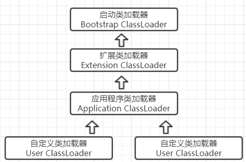

# 类加载器

把类加载阶段的“通过一个类的全限定名来获取描述此类的二进制字节流”这个动作放到虚拟机之外去实现。以便让应用程序自己决定如何获取所需的类,实现这个动作的代码模块称为"类加载器"

## 作用

类加载器虽然只用于实现类的加载动作,但它在java程序中起到的作用却远远不限于类加载阶段

对于任意一个类，都需要由它的类加载器和这个类本身一同确定其在就 Java 虚拟机中的唯一性,每一个类加载器都有一个独立的类名称空间,比较两个类是否"相等",只有在两个类是由同一个类加载器加载的前提下才有意义，也就是说，即使两个类来源于同一个 Class 文件，只要加载它们的类加载器不同，那这两个类就必定不相等。这里的“相等”包括了代表类的 Class 对象的 equals（）、isAssignableFrom（）、isInstance（）等方法的返回结果，也包括了使用 instanceof 关键字对对象所属关系的判定结果。

## 类加载器种类

在JVM的角度来看，只存在两种类加载器

* 启动类加载器(Bootstrap ClassLoader)
* 其他类加载器

## 启动类加载器

由C++语言实现（针对HotSpot）,负责将存放在`<JAVA_HOME>\lib`目录或-Xbootclasspath参数指定的路径中的类库加载到内存中。并且能被虚拟机识别的类库到JVM内存中，如果名称不符合的类库即使放在lib目录中也不会被加载。

该类加载器无法被Java程序直接引用。用户如果需要把加载请求委派给引导类加载器,那直接使用null代替即可.

## 其他类加载器

由Java语言实现,独立于虚拟机外部，并且全都继承自抽象类 java.lang.ClassLoader

### 扩展类加载器（Extension ClassLoader）

是由ExtClassLoader（sun.misc.Launcher$ExtClassLoader）实现的。它负责将Java_Home /lib/ext或者由系统变量 java.ext.dir指定位置中的类库加载到内存中，开发者可以直接使用标准扩展类加载器

### 应用程序类加载器（Application ClassLoader）

是由 AppClassLoader（sun.misc.Launcher$AppClassLoader）实现的。由于这个类加载器是ClassLoader中的getSystemClassLoader()方法的返回值，因此一般称为系统类加载器。

它负责加载用户类路径（ClassPath）上所指定的类库，开发者可以直接使用这个类加载器，如果应用程序中没有自定义过自己的类加载器，一般情况下这个就是程序中 **默认的类加载器**。

# 双亲委派模型

我们的应用程序都是由这3 种类加载器互相配合进行加载的，如果有必要，还可以加入自己定义的类加载器。这些类加载器之间的关系如下图

上图展示的类加载器之间的层次关系，称为类加载器的双亲委派模型（Parents Delegation Model）。该模型要求除了顶层的启动类加载器外，其余的类加载器都应该有自己的父类加载器，而这种父子关系一般通过组合（Composition）关系来实现，而不是通过继承（Inheritance）。

## 工作过程

如果一个类加载器收到了类加载的请求，它首先不会自己去尝试加载，而是把这个请求委派给父类加载器，每一个层次的加载器都是如此，依次递归，因此所有的加载请求最终都应该传送到顶层的启动类加载器中，只有当父加载器反馈自己无法完成此加载请求（它搜索范围中没有找到所需类）时，子加载器才会尝试自己加载。

## 好处

Java类随着它的类加载器一起具备了一种带有优先级的层次关系。

例如类java.lang.Object，它存在在rt.jar中，无论哪一个类加载器要加载这个类，最终都是委派给处于模型最顶端的启动类加载器进行加载，因此Object类在程序的各种类加载器环境中都是同一个类。

相反，如果没有双亲委派模型而是由各个类加载器自行加载的话，用户编写了一个java.lang.Object的类，并放在程序的ClassPath中，那系统中将会出现多个不同的Object类，程序将混乱。因此，如果开发者尝试编写一个与rt.jar类库中已有类重名的Java类，将会发现可以正常编译，但是永远无法被加载运行。

## 双亲委派模型的系统实现

双亲委派模型对于保证Java程序的稳定运作很重要，但它的实现却很简单，实现集中在java.lang.ClassLoader的loadClass()
方法中，在其方法中，主要判断逻辑如下：先检查是否已经被加载过，
若没有被加载过，则接着判断父加载器是否为空。
若不为空，则调用父类加载器的loadClass()方法。 若父加载器为空，则默认使用启动类加载器作为父加载器。 如果父加载失败，则抛出ClassNotFoundException异常后，再调用自己的findClass()方法进行加载。

# 自定义类加载器

双亲委派模型并不是一个强制性的约束模型，而是Java设计者推荐给开发者的类加载器的实现方式。大多数的类加载器都遵循这个模型，但是JDK中也有3次较大规模破坏双亲模型的情况，以下只着重介绍第一次“被破坏”，与后续的讲解有关。

双亲委派模型的第一次“被破坏”发生在此模型出现之前——JDK1.2发布前，此模型在JDK 1.2之后才引入，而类加载器和抽象类 java.lang.ClassLoader 添加了一个新的 protected限定的findClass()方法，而在此之前，用户去继承 java.lang.ClassLoader 的唯一目的是重写 loadClass() 方法，因为虚拟机在进行类加载的时候会调用加载器的私有方法 loadClassInternal() ，此方法唯一逻辑就是去调用自己的loadClass() 方法

**在JDK 1.2之后已不提倡用户再去覆盖loadClass() 方法，而应当把自己的类加载逻辑写到 findClass() 方法中，在loadClass() 方法逻辑里：如果父类加载失败，则会调用自己的 findClass() 方法来完成加载，这样可以保证用户自定义的类加载器时符合双亲委派规则的！**

## 采用双亲委派模型

只需要重写ClassLoader的findClass()方法即可

## 破坏双亲委派模型

重写ClassLoader的整个loadClass()方法（因为双亲委派模型的逻辑主要实现就在此方法中，若我们重写即可破坏掉。）

### 三次较大规模的"被破坏"情况

#
