[TOC]


# 基础概念

1	#{ }表示一个占位符合
2	#{id} 其中id表示接收输入的参数，参数名称就是id，如果输入参数是简单类型，#{}中的参数名可以任意
3   ${ }表示拼接sql串，将接收到的参数的内容不加任何修饰拼接在sql中。**可能引起sql注入**
4	${value} 接收输入参数的内容，如果传入类型是简单类型，${}中只能使用value


### 自增主键返回

mysql自增主键，执行insert提交之前自动生成一个自增主键
通过mysql函数获取到刚插入记录的自增主键
`LAST_INSERT_ID()`
insert之后调用此函数

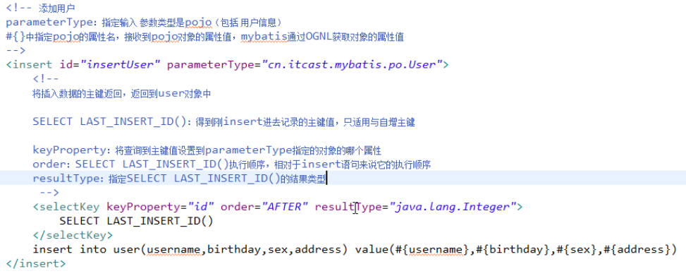

### 非自增主键返回

mysql的uuid函数生成主键，需要修改表中id字段类型为String，长度设置成35位

先通过uuid查询到主键，将主键输入到sql语句中

执行uuid语句顺序相对于insert语句之前

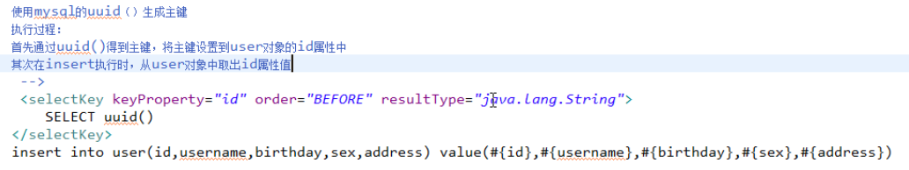


# Scope和生命周期

SqlSessionFactoryBuilder 不需要关心

SqlSessionFactory 创建后就应该在整个application中存在，不应该再创建或修改它，最好用**单例模式来管理**

SqlSession **请求域或方法域**，同时要记得**关闭**session，通过finally来确保session的关闭

SqlSession是线程不安全的，在sqlSession实现类中除了有接口中的方法（操作数据库的方法），还有数据域属性，因为是线程不安全，实验最佳的scope为方法域


# 事务默认为手动提交的

需要手动提交session。commit();或者得到session时设置为自动提交factory.openSession(true);


# mapper代理

编写mapper接口

* **在mapper.xml中namespace等于mapper接口地址**

* mapper.Java接口中的方法名和mapper.xml中statement的id一致

* mapper.java接口中的方法输入参数类型和mapper.xml中statement的parameterType指定的类型一致。

* mapper.java接口中的方法返回值类型和mapper.xml中statement的resultType指定的类型一致。

遵循这4种规范，mybatis就可以自动生成mapper接口实现类代理对象

sqlSession.getMapper(.class);

在SqlMapConfig.xml中加载映射文件

加载时使用的为**文件路径**，即用/来分隔


# mappers(映射配置)

## 加载映射

* 通过resource加载单个映射文件

	`<mapper resource="mapper/UserMapper.xml"/>`

* 通过mapper接口加载单个mapper

	通过mapper接口加载单个 映射文件
    	遵循一些规范：需要将mapper接口类名和mapper.xml映射文件**名称保持一致**，且在**一个目录**中

	`<mapper class="com.iot.mybatis.mapper.UserMapper"/> `

* 批量加载mapper(推荐使用)

	指定mapper接口的包名，mybatis自动扫描包下边所有mapper接口进行加载
    	遵循一些规范：需要将mapper接口类名和mapper.xml映射文件名称保持一致，且在一个目录中

	`<package name="com.iot.mybatis.mapper"/>`


# sqlMapConfig.xml

## properties特性

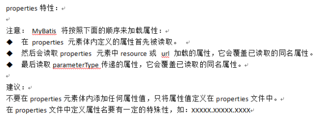

## typeAliases

类型别名是为 Java 类型设置一个短的名字。它只和 XML 配置有关，存在的意义仅在于用来减少类完全限定名的冗余。mybatis同样为许多常见的 Java 类型内建了相应的类型别名。

```xml
<typeAliases>
  <typeAlias alias="Author" type="domain.blog.Author"/>
</typeAliases>
```

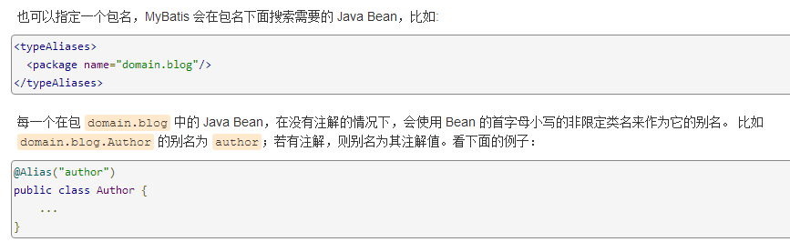

## typeHandlers

mybatis中通过typeHandlers完成jdbc类型和java类型的转换

# 输入映射

## 传递pojo的包装对象

当查询条件很复杂的时候，建议使用自定义的包装类型的pojo，在包装类型的pojo中将复杂的查询条件包装进去


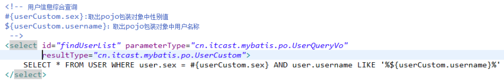

## 传递map

# 输出映射

## resultType

使用resultType进行输出映射，只有查询出来的列名和pojo中的属性名**一致**，该列才可以映射成功

如果查询出来的列名和pojo中的属性名全部不一致，没有创建pojo对象

只有查询出来的列名和pojo中的属性有一个一致，就会创建pojo对象

只有查询出来的结果集只有一行一列是才可以用简单类型映射

## resultMap

如果查询出来的列名和pojo的属性名不一致，通过定义resultMap对列名和pojo属性名之间做一个映射关系

定义resultMap

使用resultMap作为statement的输出映射类型

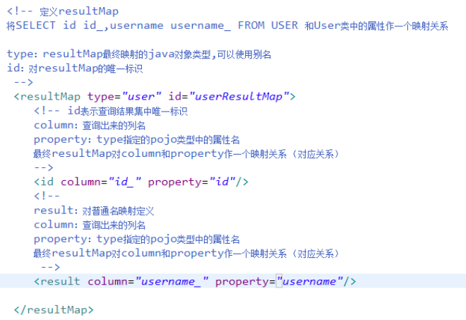

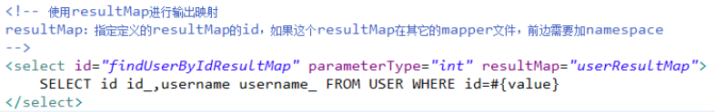

# 动态sql

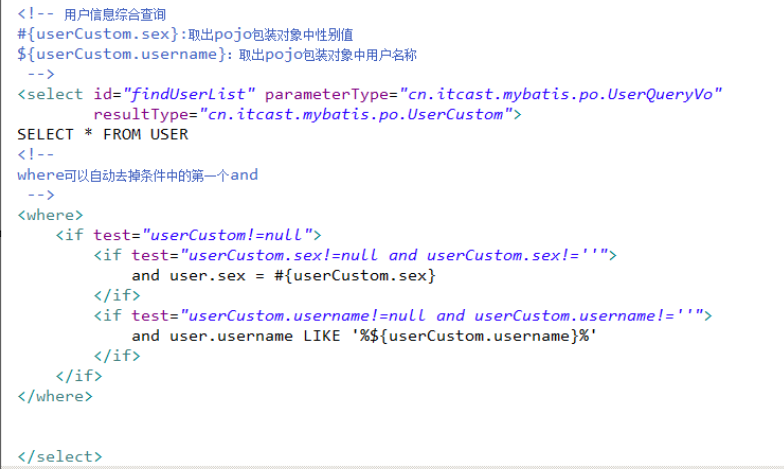

## sql片段

定义sql片段

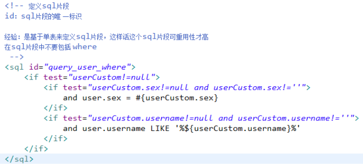

引用sql片段

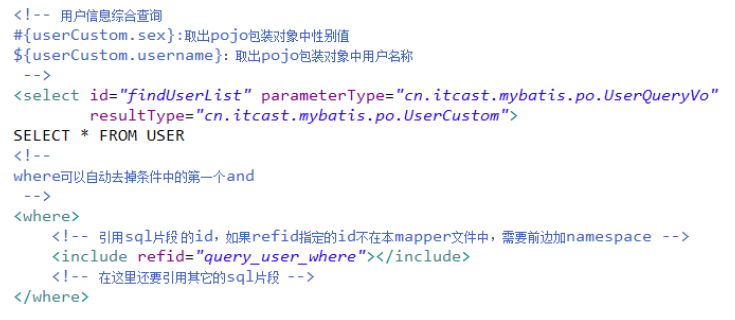

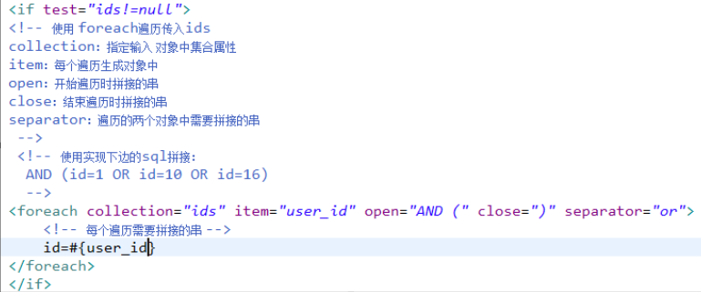


# 延迟加载


# 逆向工程


