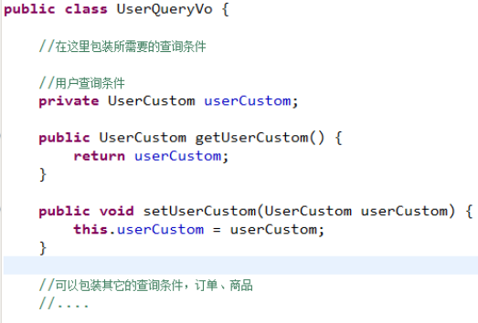

[TOC]


# 基础概念

http://blog.csdn.net/acmman/article/details/46793289

* #{ }表示一个占位符合
* #{id} 其中id表示接收输入的参数，参数名称就是id，如果输入参数是简单类型，#{}中的参数名可以任意
* ${ }表示拼接sql串，将接收到的参数的内容不加任何修饰拼接在sql中。**可能引起sql注入**
* ${value} 接收输入参数的内容，如果传入类型是简单类型，${}中只能使用value

### 自增主键返回

mysql自增主键，执行insert提交之前自动生成一个自增主键
通过mysql函数获取到刚插入记录的自增主键
`LAST_INSERT_ID()`
insert之后调用此函数


### 非自增主键返回

mysql的uuid函数生成主键，需要修改表中id字段类型为String，长度设置成35位

先通过uuid查询到主键，将主键输入到sql语句中

执行uuid语句顺序相对于insert语句之前


# Scope和生命周期

SqlSessionFactoryBuilder 不需要关心

SqlSessionFactory 创建后就应该在整个application中存在，不应该再创建或修改它，最好用**单例模式来管理**

SqlSession **请求域或方法域**，同时要记得**关闭**session，通过finally来确保session的关闭

SqlSession是线程不安全的，在sqlSession实现类中除了有接口中的方法（操作数据库的方法），还有数据域属性，因为是线程不安全，所以最佳的scope为方法域

映射器实例（Mapper Instances）

映射器是创建用来绑定映射语句的接口。映射器接口的实例是从 SqlSession 中获得的。因此从技术层面讲，映射器实例的最大作用域是和 SqlSession 相同的，因为它们都是从 SqlSession 里被请求的。尽管如此，映射器实例的最佳作用域是方法作用域。也就是说，映射器实例应该在调用它们的方法中被请求，用过之后即可废弃。并不需要显式地关闭映射器实例，尽管在整个请求作用域（request scope）保持映射器实例也不会有什么问题，但是很快你会发现，像 SqlSession 一样，在这个作用域上管理太多的资源的话会难于控制。所以要保持简单，最好把映射器放在方法作用域（method scope）内。下面的示例就展示了这个实践：
```java
SqlSession session = sqlSessionFactory.openSession();
try {
  BlogMapper mapper = session.getMapper(BlogMapper.class);
  // do work
} finally {
  session.close();
}
```

# 事务默认为手动提交的

需要手动提交session。commit();或者得到session时设置为自动提交factory.openSession(true);


# mapper代理

编写mapper接口

* **在mapper.xml中namespace等于mapper接口地址**

* mapper.Java接口中的方法名和mapper.xml中statement的id一致

* mapper.java接口中的方法输入参数类型和mapper.xml中statement的parameterType指定的类型一致。

* mapper.java接口中的方法返回值类型和mapper.xml中statement的resultType指定的类型一致。

遵循这4种规范，mybatis就可以自动生成mapper接口实现类代理对象

sqlSession.getMapper(.class);

在SqlMapConfig.xml中加载映射文件

加载时使用的为**文件路径**，即用/来分隔


# mappers(映射配置)

## 加载映射

* 通过resource加载单个映射文件

	`<mapper resource="mapper/UserMapper.xml"/>`

* 通过mapper接口加载单个mapper

	通过mapper接口加载单个 映射文件遵循一些规范：需要将mapper接口类名和mapper.xml映射文件 **名称保持一致** ，且在 **一个目录** 中

	`<mapper class="com.iot.mybatis.mapper.UserMapper"/> `

* 批量加载mapper(推荐使用)

	指定mapper接口的包名，mybatis自动扫描包下边所有mapper接口进行加载
    	遵循一些规范：需要将mapper接口类名和mapper.xml映射文件名称保持一致，且在一个目录中

	`<package name="com.iot.mybatis.mapper"/>`


# sqlMapConfig.xml

## properties特性


## typeAliases

类型别名是为 Java 类型设置一个短的名字。它只和 XML 配置有关，存在的意义仅在于用来减少类完全限定名的冗余。mybatis同样为许多常见的 Java 类型内建了相应的类型别名。

```xml
<typeAliases>
  <typeAlias alias="Author" type="domain.blog.Author"/>
</typeAliases>
```


## typeHandlers

mybatis中通过typeHandlers完成jdbc类型和java类型的转换

# 输入映射

## 传递pojo的包装对象

当查询条件很复杂的时候，建议使用自定义的包装类型的pojo，在包装类型的pojo中将复杂的查询条件包装进去





## 传递map

# 输出映射

## resultType

使用resultType进行输出映射，只有查询出来的列名和pojo中的属性名**一致**，该列才可以映射成功

如果查询出来的列名和pojo中的属性名全部不一致，没有创建pojo对象

只有查询出来的列名和pojo中的属性有一个一致，就会创建pojo对象

只有查询出来的结果集只有一行一列是才可以用简单类型映射

## resultMap

如果查询出来的列名和pojo的属性名不一致，通过定义resultMap对列名和pojo属性名之间做一个映射关系

定义resultMap

使用resultMap作为statement的输出映射类型

```XML
<!-- 定义resultType  

type:resultMap最终所映射的Java对象类型，可以使用别名  
id:对resultMap的唯一标识   
-->  
<resultMap type="user" id="userResultMap">  
    <!-- id表示查询结果集中唯一标识   
    column:查询出的列名  
    property:type所指定的POJO中的属性名  
    最终reslutMap对column和property做一个映射关系(对应关系)  
    -->  
    <id column="_id" property="id"/>  
    <!-- 对普通列的映射定义 -->  
    <result column="_username" property="username"/>  
</resultMap>  
```

```xml
<!-- 使用resultMap进行输出映射   
    resultMap:指定定义的resultMap的id，如果这个resultMap在其它的mapper文件，前面需要加namespace  
    -->  
<select id="findUserByResultMap" parameterType="int" resultMap="userResultMap">  
    select id _id,username _username from user where id=#{value}  
</select>
```

# 动态sql


## sql片段

定义sql片段


引用sql片段


### foreach

```xml
<sql id="query_user_where">  
    <if test="ids!=null">  
        <!-- 使用foreach遍历传入ids   
        collection指定输入对象中集合属性  
        item每次遍历生成的对象名  
        open开始遍历时要拼接的串  
        close开始遍历时要拼接的串  
        separator遍历的两个对象中间需要拼接的串  
        -->  
        <!-- AND (id=1 OR id=3 OR id=5)-->  
        <foreach collection="ids" item="user_id" open="AND (" close=")" separator="OR">  
            <!-- 每次遍历要拼接的串 -->  
            id=#{user_id}  
        </foreach>  
    </if>  
</sql>  
```

# 延迟加载

mybatis默认没有开启延迟加载，需要在SqlMapConfig.xml中setting配置。

在mybatis核心配置文件中配置：lazyLoadingEnabled、aggressiveLazyLoading

* lazyLoadingEnabled 全局性设置懒加载。如果设为‘false’，则所有相关联的都会被初始化加载。

* aggressiveLazyLoading 当设置为‘true’的时候，懒加载的对象可能被任何懒属性全部加载。否则，每个属性都按需加载。

```xml
<configuration>  
    ......  
    <settings>  
        <!-- 打开延迟加载的开关 -->  
        <setting name="lazyLoadingEnable" value="true"/>  
        <!-- 将积极加载改为消极加载(及按需加载) -->  
        <setting name="aggressiveLazyLoading" value="false"/>  
    </settings>  
    ......  
</configuration>  
```

## 什么是延迟加载

resultMap可以实现高级映射（使用association、collection实现一对一及一对多映射），association、collection具备延迟加载功能。

延迟加载：先从单表查询、**需要时** 再从关联表去关联查询(可以不通过mybatis提供的方式实现,将sql分开写也可以实现)

例:

```xml
<!-- 查询订单，关联查询用户，用户信息需要延迟加载 -->  
    <select id="findOrdersUserLazyLoading" resultMap="OrdersUserLazyLoadingResultMap">  
        SELECT * FROM orders  
    </select>
```

```xml
<!-- 延迟加载使用的sql -->  
    <select id="findUserById" parameterType="int" resultType="cn.edu.hpu.mybatis.PO.User">  
      SELECT * FROM USER WHERE id=#{id}  
    </select>  
```

```xml
<!-- 延迟加载的resultMap -->  
    <resultMap id="OrdersUserLazyLoadingResultMap" type="cn.edu.hpu.mybatis.PO.Orders">  
        <!-- 对订单信息进行映射配置 -->  
        <id column="id" property="id"/>  
        <result column="user_id" property="userId"/>  
        <result column="number" property="number"/>  
        <result column="creattime" property="creattime"/>  
        <result column="note" property="note"/>  

        <!-- 实现延迟加载用户信息   
        select:指定延迟加载所需要执行的sql语句,也就是Mapper.xml配置文件中的某个SELECT标签对  
        column:订单信息中关联用户信息查询的列，是user_id。  
        关联的sql理解为:  
        SELECT orders.*,  
               (SELECT username FROM USER WHERE orders.user_id=user.id) username,  
               (SELECT sex FROM USER WHERE orders.user_id=user.id) sex FROM orders;-->  
        <association property="user" javaType="cn.edu.hpu.mybatis.PO.User" select="findUserById" column="user_id">  

        </association>  

    </resultMap>  
```

测试思路：

1. 执行上边mapper方法（findOrdersUserLazyLoading），内部去调用cn.itcast.mybatis.mapper.OrdersMapperCustom中的findOrdersUserLazyLoading只查询orders信息（单表）。

2. 在程序中去遍历上一步骤查询出的List<Orders>，当我们调用Orders中的getUser方法时，开始进行延迟加载。

3. 延迟加载，去调用UserMapper.xml中findUserbyId这个方法获取用户信息。

# 逆向工程


#
