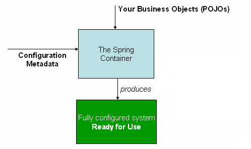

[TOC]

# 概念

Inversion of Control (IoC) 控制反转，最常见的为dependency injection (DI) 依赖注入。

依赖注入即一个对象**定义**他的**依赖**的一个过程，这个过程只能通过构造函数的参数，工厂方法的参数，或者已经被构造或者从工厂方法返回的对象的 setter 方法设置其属性来实现。

依赖，就是和它一起工作的对象（the other objects they work with）。我认为可以理解为一个对象运作时需要的基础，即在这些基础之上才可以正常运行。

## 容器

org.springframework.context.ApplicationContext 代表 Spring IoC 容器，并负责实例化，配置和组装上述 bean 的接口。容器是通过对象实例化，配置，和读取配置元数据汇编得到对象的构建。

