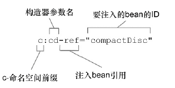

[TOC]

# spring容器

Spring容器负责创建对象，装配它们，配置它们并管理它们的整个生命周期，从生存到死亡（在这里，可
能就是new到finalize()）。

Spring容器使用DI管理构成应用的组件，它会创建**相互协作**的组件之间的**关联**。

## 容器实现

bean工厂 太过低级不常用

ApplicationContext 

### ApplicationContext 

AnnotationConfigApplicationContext：从一个或多个基于Java的配置类中加载Spring应用上下文。

AnnotationConfigWebApplicationContext：从一个或多个基于Java的配置类中加载Spring Web应用上下文。

ClassPathXmlApplicationContext：从类路径下的一个或多个XML配置文件中加载上下文定义，把应用上下文的定义文件作为类资源。

FileSystemXmlapplicationcontext：从**文件系统**下的一个或多个XML配置文件中加载上下文定义。

XmlWebApplicationContext：从Web应用下的一个或多个XML配置文件中加载上下文定义。

#### FileSystemXmlapplicationcontext

ApplicationContext context = new FileSystemXmlapplicationcontext("c:/knight.xml");

#### ClassPathXmlApplicationContext

ApplicationContext context = new ClassPathXmlApplicationContext("knight.xml");

在所有的类路径（包含JAR文件）下查找 knight.xml文件。

#### AnnotationConfigApplicationContext

ApplicationContext context = new AnnotationConfigApplicationContext("com.knights.KnightConfig.class");

### 调用ApplicationContext获取bean

使用getBean()方法

context.getBean("配置文件中bean的id");

# wiring bean 装配bean

* 在XML中进行显式配置。
* 在Java中进行显式配置。
* 隐式的bean发现机制和自动装配。

尽可能地使用自动配置的机制，显式配置越少越好。

## 自动化装配

组件扫描（component scanning）：Spring会自动发现应用上下文中所创建的bean。
自动装配（autowiring）：Spring自动满足bean之间的依赖。


### 组件扫描

使用@Component注解，表明该类会作为组件类，并告知Spring要为这个类创建bean。

组件扫描默认是**不启用**的。

* @ComponentScan注解启用组件扫描

@Configuration
@ComponentScan
public class CDPlayConfig{
}

没有其他配置的话，@ComponentScan默认会扫描与配置类相同的包。Spring将会扫描这个包以及这个包下的所有子包，查找带有@Component注解的类。

* XML启用组件扫描

<context:component-scan base-package="想扫描的包">

测试

```java
@RunWith(SpringJUnit4ClassRunner.class)
@ContextConfiguration(classes=CDPlayerConfig.class)
public class CDPlayerTest {

	@Autowired
	private CompactDisc cd;
	
}
```

@RunWith(SpringJUnit4ClassRunner.class) 在测试开始的时候自
动创建Spring的应用上下文。

@ContextConfiguration会告诉它需要在CDPlayerConfig中加载配置。因为CDPlayerConfig类中包含了@ComponentScan，
因此最终的应用上下文中应该包含CompactDiscbean。

#### 为组件扫描的bean命名

没有明确地为bean设置ID，Spring会根据类名为其指定一个ID。将类名的第一个字母变为小写即为bean的ID。

* 使用@Component("ID名称")的方式为bean命名

* 使用Java依赖注入规范提供的@Named("ID名称")方式

#### 设置组件扫描的基础包

使用@ComponentScan("包名")指定扫描的包名

更清晰的表达方式为@ComponentScan(basePackages="包名")

@ComponentScan(basePackages={"包名1"，"包名1"})指定多个包

@ComponentScan(basePackageClasses={类1.class，类2.class})指定扫描类所在的包，这种方式比使用String类型更**安全**，使用String类型在重构代码时可能会出现错误
采用这种方式可以在包中创建一个用来进行扫描的空标记接口（marker interface）。

### 自动装配

#### @Autowired

是Spring特有的注解

@Autowired注解可以使用在构造器上，表明创建bean的时候会自动传入可设置的类型

@Autowired注解用在属性的Setter方法上和类的任何方法上。Spring会尽可能的满足依赖

没有匹配bean的情况下，Spring会抛出一个异常。为了避免异常的出现，你可以将@Autowired的required属性设置为false：
@Autowired(required=false)

#### @Inject

@Inject注解来源于Java依赖注入规范，可以用来避免使用Spring特有的注解

### 显示装配bean

#### 通过Java代码装配bean

比如说在想要将第三方库中的组件装配到你的应用，就不能使用自动装配了

显式配置时，**JavaConfig是更好的方案**，因为它更为强大、**类型安全**并且**对重构友好**。

JavaConfig不应该包含任何业务逻辑，JavaConfig也不应该侵入到业务逻辑代码之中。

通常会将JavaConfig放到单独的包中，使它与其他的应用程序逻辑分离开来，这样对于它的意图就不会产生困惑了。


* 创建JavaConfig类

关键在于为其添加@Configuration注解

@Configuration
public class CDPlayConfig{
}

* 在JavaConfig中声明bean

编写一个方法，这个方法会创建所需类型的实例，然后给这个方法添加@Bean注解。比方说，下面的代码声明了CompactDisc bean：

@Bean
public CompactDisc setPeppers(){
	return new SetPeppers();
}

@Bean注解会告诉Spring这个方法将会返回一个对象，该对象要注册为Spring应用上下文中的bean。

默认情况下，bean的ID与带有@Bean注解的方法名是一样的。可以使用@Bean(name="名字")来为bean命名

##### 借助JavaConfig实现注入

装配bean的最简单方式就是引用创建bean的方法。

@Bean
public CDPlayer cdPlayer(){
	return new CDPlayer(sgtPeppers());
}

##### 通过XML装配bean

最为简单的Spring XML配置,在JavaConfig中所需要的只是@Configuration

```xml
<?xml version="1.0" encoding="UTF-8"?>
<beans xmlns="http://www.springframework.org/schema/beans"
       xmlns:xsi="http://www.w3.org/2001/XMLSchema-instance"
       xsi:schemaLocation="http://www.springframework.org/schema/beans
		http://www.springframework.org/schema/beans/spring-beans.xsd
		http://www.springframework.org/schema/context">

	<!-- configuration details go here -->
	
</beans>
```

声明一个简单的`<bean>`

`<bean id="名字" class="类的完整名称" />`

如果没有明确给定ID，这个bean将会根据全限定类名来进行命名。bean的ID将
会是“类的完整名称#0”。

不再需要直接负责创建SgtPeppers的实例，在基于JavaConfig的配置中，我们是需要这样做的。当Spring发现这个<bean>元素时，它将会调用SgtPeppers的默认构造器来创建bean。**在JavaConfig配置方式中，你可以通过任何可以想象到的方法来创建bean实例**。

不能保证class属性设置正确，类型不安全，不支持重构


借助构造器注入初始化bean

```xml
<bean id="" class="">
	<constructor-arg ref="bean的ID" />
</bean>
```

使用c-命名空间

```xml
<bean id="" class=""
	c:cd-ref="bean的ID">
```

使用索引来识别构造器参数

```xml
<bean id="" class=""
	c:_0-ref="bean的ID">
```



将字面量注入到构造器中

```xml
<bean id="" class="">
	<constructor-arg value="" />
</bean>
```

装配集合

```xml
<constructor-arg>
	<list>
		<value></value> 装配值
			...
	 	<ref bean=""> 装配引用
	</list>
```

设置属性

```xml
<bean id="" class="">
	<property name="" ref="" /> 
	<property name="" value="" /> 
</bean>
```


### 导入和混合配置

自动装配的时候会考虑到Spring容器中所有的bean,不管它是在JavaConfig或XML中声明的还是通过组件扫描获取到的。

#### 在JavaConfig中引用XML配置

在JavaConfig变得笨重的时候，可以将其拆分

最好的方式是单独创建一个配置类，再在这个类中使用用@Import将配置类组合在一起

@Configuration
@Import({类1.class，类2.class})
public class Config{
}

在JavaConfig中可以使用@ImportResource注解，注解xml文件位于根目录下时

@Configuration
@Import({类1.class，类2.class})
@ImportResource("xml文件名")
public class Config{
}


#### 在XML配置中引用JavaConfig

尽量采用在JavaConfig中引用XML配置的方式，所以不记笔记了


## 处理自动装配的歧义性

仅有一个bean匹配所需的结果时，自动装配才是有效的。如果不仅有一个bean能够匹配结果的话，这种歧义性会阻碍Spring自动装配属性、构造器参数或方法参数。

例如用@Autowired注解标注了setDessert()方法：

@Autowired
public void setDessert(Dessert dessert){
	this.dessert = dessert;
}

Dessert是一个接口，并且有三个类实现了这个接口

@Component
public class Cake implements Dessert {...}

@Component
public class Cookies implements Dessert {...}

@Component
public class IceCream implements Dessert {...}

Spring会抛出NoUniqueBeanDefinitionException异常

### 标示首选的bean

可以使用@Primary来注解，当遇到歧义性的时候，Spring将会使用首选的bean，而不是其他可选的bean。

@Component
@Primary
public class Cake implements Dessert {...}

Java配置显式地声明IceCream
@Bean
@Primary
public Dessert Cake(){
	return new Cake();
}

xml配置

```xml
<bean id="" class="" primary="true" />
```

首选bean只能有一个

### 限定自动装配的bean

使用@Qualifier注解,@Qualifier("bean的ID")

@Autowired
@Qualifier("cake")
public void setDessert(Dessert dessert){
	this.dessert = dessert;
}

更准确地讲，@Qualifier("iceCream")所引用的bean要具有String类型的“iceCream”作为限定符。如果没有指定其他的限定符的话，所有的bean都会给定一个**默认的限定符**，这个限定符与bean的ID相同。因此，框架会将具有“iceCream”限定符的bean注入到setDessert()方法中。这恰巧就是ID为iceCream的bean，它是IceCream类
在组件扫描的时候创建的。

#### 创建自定义的限定符

重构IceCream，将其重命名为Gelato的话，bean的ID和默认的限定符会变为gelato，这就无法匹配setDessert()方法中的限定符。自动装配会失败。这样的方式是紧耦合的


为bean设置自己的限定符，而不是依赖于将bean ID作为限定符。在这里所需要做的就是在bean声明上添加@Qualifier注解。

@Component
@Qualifier("cold")
public class IceCream implements Dessert {...}

通过Java配置显式定义bean的时候，@Qualifier也可以与@Bean注解一起使用

@Bean
@Qualifier("cold")
public Dessert IceCream(){
	return new IceCream();
}

Java不允许在同一个条目上重复出现相同类型的多个注解。

所以可以创建自定义的限定符注解，借助这样的注解来表达bean所希望限定的特性。

创建一个注解，它本身要使用@Qualifier注解来标注。

@Target({ElementType.CONSTRUCTOR,ElementType.FIELD,ElementType.METHOD,ElementType.TYPE})
@Retention(RetentionPolicy.RUNTIME)
@Qualifier
public @interface 注解名 {}


# 环境与profile

不同的环境中某个bean可能会有所不同，我们必须要有一种方法来配置DataSource，使其在每种环境下都会选择最为合适的配置。

其中一种方式就是在单独的配置类（或XML文件）中配置每个bean，然后在构建阶段（可能会使用Maven的profiles）确定要将哪一个配置编译到可部署的应用中。这种方式的问题在于要为每种环境重新构建应用。当从开发阶段迁移到QA阶段时，重新构建也许算不上什么大问题。但是，从QA阶段迁移到生产阶段时，重新构建可能会引入bug并且会在QA团队的成员中带来不
安的情绪。

**而Spring所提供的解决方案并不需要重新构建。**

## 配置profile bean

在3.1版本中，Spring引入了bean profile的功能。要使用profile，你首先要将所有不同的bean定义整理到一个或多个profile之中，在将应用部署到每个环境时，要确保对应的profile处于激活（active）的状态。

可以使用@Profile注解指定某个bean属于哪一个profile。

@Profile注解应用在了类级别上。它会告诉Spring这个配置类中的bean只有在dev profile激活时才会创建。如果dev profile没有激活的话，那么带有@Bean注解的方法都会被忽略掉。


暂时跳过

# bean的作用域

在默认情况下，Spring应用上下文中所有bean都是作为以单例（singleton）的形式创建的。也就是说，不管给定的一个bean被注入到其他bean多少次，每次所注入的都是同一个实例。


Spring定义了多种作用域，可以基于这些作用域创建bean，

单例（Singleton）：在整个应用中，只创建bean的一个实例。
原型（Prototype）：每次注入或者通过Spring应用上下文获取的时候，都会创建一个新的
bean实例。
会话（Session）：在Web应用中，为每个会话创建一个bean实例。
请求（Rquest）：在Web应用中，为每个请求创建一个bean实例。

使用组件扫描来发现和声明bean，可以在bean的类上使用@Scope注解
@Component
@Scope(ConfigurableBeanFactory.SCOPE_PROTOTYPE)
public class notepad {}

也可以使用@Scope("prototype")

java配置中

@Bean
@Scope(ConfigurableBeanFactory.SCOPE_PROTOTYPE)
public Dessert IceCream(){
	return new IceCream();
}

xml

```xml
<bean id="" class="" scope="prototype" />
```

## web应用中bean的域

在Web应用中，实例化在会话和请求范围内共享的bean

@Component
@Scope(ConfigurableBeanFactory.SCOPE_SESSION,
		proxyMode=ScopedProxyMode.INTERFACES)
public ShoppingCart cart() {...}

假设我们要将ShoppingCart bean注入到单例StoreService bean的Setter方法中

@Component
public clss StoreService{
	@Autowired
	public void setShoppingCart(ShoppingCart shoppingCart){
	this.shoppingCart = shoppingCart;
	}
}

因为StoreService是一个单例的bean，会在Spring应用上下文加载的时候创建。当它创建的时候，Spring会试图将ShoppingCart bean注入到setShoppingCart()方法中。但是ShoppingCart bean是会话作用域的，此时并不存在。直到某个用户进入系统，创建了会话之后，才会出现ShoppingCart实例。

系统中将会有多个ShoppingCart实例：每个用户一个。我们并不想让Spring注入某个固定的ShoppingCart实例到StoreService中。我们希望的是当StoreService处理购物车功能时，它所使用的ShoppingCart实例恰好是当前会话所对应的那一个。

Spring并不会将实际的ShoppingCart bean注入到StoreService中，Spring会注入一个到ShoppingCart bean的代理，如图3.1所示。这个代理会暴露与ShoppingCart相同的方用ShoppingCart的方法时，代理会对其进行懒解析并将调用委托给会话作用域内真正的ShoppingCart bean。

proxyMode属性被设置成了ScopedProxyMode.INTERFACES，这表明这个代理要实现ShoppingCart接口，并将调用委托给实现bean。

如果ShoppingCart是接口而不是类的话，这是可以的（也是最为理想的代理模式）。但如果ShoppingCart是一个具体的类的话，Spring就没有办法创建基于接口的代理了。此时，它必须使用CGLib来生成基于类的代理。所以，如果bean类型是具体类的话，我们必须要将proxyMode属性设置为ScopedProxyMode.TARGET_CLASS，以此来表明要以生成目标类扩展的方式创建代理。

尽管我主要关注了会话作用域，但是请求作用域的bean会面临相同的装配问题。因此，请求作用域的bean应该也以作用域代理的方式进行注入。


## 运行时值注入

### 属性占位符（Property placeholder）

### 使用Spring表达式语言进行装配


