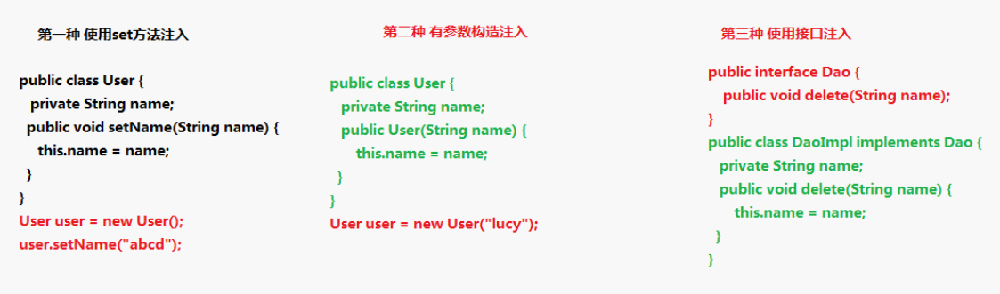
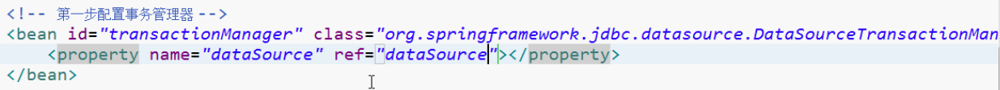

[TOC]

# spring 概念

AOP ：扩展功能不是修改源代码实现

IOC ：不通过new方式创建对象，而是交给spring配置创建

spring是一站式框架
spring在javaee三层结构中，每一层都提供不同的解决技术

# IOC底层原理

底层原理使用技术
* xml配置文件
* dom4j解决xml
* 工厂设计模式
* 反射

### 传统new创建对象的缺陷

假如类名发生变化或者类的方法发生变化，使用该类的代码也需要跟着发生变化，耦合度太高


### IOC的原理


## IOC和DI的区别

DI :向类里面的属性中设置值

# IOC配置文件方式

## 创建spring配置文件

spring配置文件名称和位置是不固定的
建议放在src下面，官方建议applicationContext.xml

引入scheme约束
spring428\spring-framework-4.2.8.RELEASE-docs\spring-framework-reference\html\xsd-configuration.html

通过ApplicationContext加载配置文件

### 解决配置文件没有提示

spring引入scheme约束，把约束文件引入到eclipse中

## spring的bean管理（xml方式）

bean实例化的方式

* 使用类的无参构造创建
	类中没有无参构造函数会出现异常
* 使用静态工程创建
* 使用动态工程创建

### bean标签的属性

* id属性
	不能包含特殊符号 下划线也不能
	根据id值得到配置对象
* class属性
	创建对象所在类的全路径
* name属性
	功能和id属性一样，name可以包含特殊符号，但现在不使用这个属性
* scope
	singleton 
		默认值 单例的 在整个应用中，值创建bean的一个实例
	prototype 
		每次注入或者通过spring Application Context获取时，都会创建一个新的bean实例
	request
	session
	globalSession

### 属性注入

属性注入方式



spring支持

**set方法注入**
`<property>`标签
name表示类中的属性名
value设置具体的值
ref表示引用对象，值为对象的id值
array，list，map，properties注入复杂属性

有参构造注入
`<constructor-arg>`标签

# spring整合web项目原理

* 加载spring核心配置文件
	ApplicationContext context = new AnnotationConfigApplicationContext("com.knights.KnightConfig.class");
 功能可以实现但是效率很低

实现思想：把加载配置文件和创建对象过程，在服务器启动的时候完成

实现原理
* ServletContext 对象
* 监听器
* 具体使用
	在服务器启动的时候，为每个项目创建一个ServletContext对象
	在ServletContext对象创建的时候，使用监听器可以监听到ServletContext对象什么时候被创建
	ServletContext对象创建时，加载spring配置文件，把配置文件配置对象创建
	把创建出来的对象放到ServletContext域对象方法
	获取对象的时候，从ServletContext域中得到


## spring的bean管理（注解方式）

创建配置文件，引入约束

开启注解扫描

<context:component-scan base-package="想扫描的包">

会到包里面扫描类，方法，属性上面是否有注解

### 注解创建对象

在创建对象的类上加上@Component

使用@Component("ID名称")的方式为bean命名

@Component
@Controller web层
@Service  业务层
@Repository  持久层

目前4个注解的功能是一样的

使用组件扫描来发现和声明bean，可以在bean的类上使用@Scope注解
@Component
@Scope(ConfigurableBeanFactory.SCOPE_PROTOTYPE)
public class notepad {}

也可以使用@Scope("prototype")

java配置中

@Bean
@Scope(ConfigurableBeanFactory.SCOPE_PROTOTYPE)
public Dessert IceCream(){
	return new IceCream();
}

### 注解注入属性

@Autowired


# AOP

## 概念特点

扩展功能不通过修改源代码实现

## 原理


## aop术语

见spring实战


## Aspectj

是一个面向切面的框架，不是spring的一部分，和spring一起使用实现aop

扩展了java语言，定义了aop语法，有一个专门的编译器来生成遵守java字节编码规范的class文件

spring2.0以后新增了对AspectJ切点表达式的支持

建议使用AspectJ方式来开发AOP

实现aop方式
基于AspectJ的xml配置
基于AspectJ的注解配置

## AOP准备
aop的jar包
Aspect的jar包
和相关jar包


创建spring核心xml配置，导入aop约束


## 使用表达式配置切入点
 
切入点，实际增强的方法

常用的表达式execution(<访问修饰符>？<返回类型>(<参数>)<异常>)


## AspectJ的aop操作

配置对象

配置aop对象

```xml
<aop:config>

<aop:pointcut expression="" id=""> 配置切点  expression 表达式指定要增强的方法

<aop:aspect> 配置切面 ref指定用来增强的类

```


### 注解方式aop

创建对象

spring核心配置文件中，开启aop扫描 
<aop:aspectj-autoproxy>

在增强类上使用注解


# Spring整合web项目


# spring jdbcTemplate

添加


## spring配置连接池

导入jar包

创建spring配置文件，配置连接池

# spring事务管理

spring事务管理方式

第一种 编程式事务管理（一般不用）
第二种 声明式事务管理


配置事务管理器

## 基于xml方式

配置文件方式使用aop的思想实现

1.配置事务管理器


2.配置事务增强


3.配置切面


## 基于注解实现

1.配置事务管理器



2.开启事务的注解


3.在要使用事务的方法所在类上面添加注解


