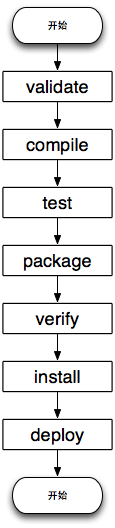
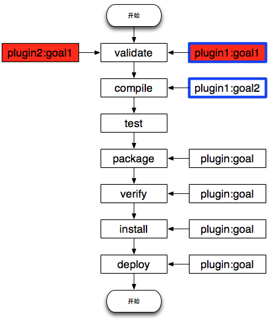

# 一些博客

http://www.jianshu.com/p/fd43b3d0fdb0

# 安装注意

修改`apache-maven-3.5.2\conf\settings.xml`的`<localRepository>D:\package\maven\.m2\repository</localRepository>`来修改本地仓库目录

# 构建过程中的环节

* 清理
    将以前编译的class文件删除
* 编译
    编译java源文件
* 测试
    自动测试，自动调用junit
* 报告
    测试程序执行结果
* 打包
    动态web工程打war包，java工程打jar包
* 安装
    maven特定的概念：把打包得到的文件复制到“仓库中”
* 部署
    将动态web工程生成的war包复制到servlet容器的指定目录下

# 常用maven命令

注意 执行与构建过程相关的maven命令，必须进入pom.xml所在的目录


# 概念

## POM

project object model
项目对象模型

## 坐标

groupid 公司或组织域名倒序+项目名
artifactid 模块名
version

```
<dependency>
    <groupId>org.springframework</groupId>
    <artifactId>spring-core</artifactId>
    <version>4.3.13.RELEASE</version>
</dependency>
```

maven工程的坐标与仓库中路径的对应关系

`repository路径\org\springframework\spring-core\4.3.13.RELEASE\spring-core-4.2.0.RELEASE.jar`

# 生命周期

生命周期的各个阶段的具体任务是由插件来完成的

maven核心程序为了更好的实现自动化构建,不论执行生命周期中的那一个阶段,都是从这个生命周期的最初阶段开始

可以指定多个不同构建生命周期的阶段
    执行 mvn clean deploy 命令，首先完成的 clean lifecycle，将以前构建的文件清理，然后再执行 default lifecycle 的 validate, compile, test, package, verify, insstall, deploy 阶段，将 package 阶段创建的包发布到远程仓库中。


## 阶段

default 生命周期的核心阶段如下所示：



## 阶段与插件的关系

如上所述，Maven 将构建过程定义为 default lifecycle，并将 default lifecycle 划分为一个个的阶段 phase，这一系列 phase **仅仅是规定执行顺序**，至于每个阶段做什么工作？由谁来做？答案就在 插件（plugins） 中。
Maven 对工程的所有操作实实在在的都是由 插件 来完成的。一个插件可以支持多种功能，称之为目标（goal），例如：compiler 插件有两个目标：compile 和 testCompile，分别实现编译源代码 和 编译测试代码。
如何将插件与 Maven 的构建生命周期绑定在一起呢？通过将插件的目标（goal）与 build lifecycle 中 phase 绑定到一起，这样，当要执行某个 phase 时，就调用插件来完成绑定的目标。
如下图所示：从图中可以看出，每一个阶段可以绑定0 个 或 多个目标，每个插件可以提供 1 个或多个目标。



## 三个独立的生命周期

* clean

| phase | function |
| :------------- | :------------- |
| pre-clean execute | execute processes needed prior to the actual project cleaning |
| clean | remove all files generated by the previous build |
| post-clean | execute processes needed to finalize the project cleaning |

* default

| phase | function |
| :------------- | :------------- |
| validate | validate the project is correct and all necessary information is available. |
| initialize | initialize build state, e.g. set properties or create directories. |
| generate-sources | generate any source code for inclusion in compilation. |
| process-sources | process the source code, for example to filter any values. |
| generate-resources | generate resources for inclusion in the package. |
| **process-resources** | copy and process the resources into the destination directory, ready for packaging. |
| compile | compile the source code of the project. |
| process-classes | post-process the generated files from compilation, for example to do bytecode enhancement on Java classes. |
| generate-test-sources | generate any test source code for inclusion in compilation. |
| process-test-sources | process the test source code, for example to filter any values. |
| generate-test-resources | create resources for testing. |
| process-test-resources | copy and process the resources into the test destination directory. |
| test-compile | compile the test source code into the test destination directory |
| process-test-classes | post-process the generated files from test compilation, for example to do bytecode enhancement on Java classes. For Maven 2.0.5 and above. |
| test | run tests using a suitable unit testing framework. These tests should not require the code be packaged or deployed. |
| prepare-package | perform any operations necessary to prepare a package before the actual packaging. This often results in an unpacked, processed version of the package. (Maven 2.1 and above) |
| package | take the compiled code and package it in its distributable format, such as a JAR. |
| pre-integration-test perform | actions required before integration tests are executed. This may involve things such as setting up the required environment. |
| integration-test | process and deploy the package if necessary into an environment where integration tests can be run. |
| post-integration-test | perform actions required after integration tests have been executed. This may including cleaning up the environment. |
| verify | run any checks to verify the package is valid and meets quality criteria. |
| install | install the package into the local repository, for use as a dependency in other projects locally. |
| deploy | done in an integration or release environment, copies the final package to the remote repository for sharing with other developers and projects. |

* site

生成站点文档

| phase | function |
| :------------- | :------------- |
| pre-site | execute processes needed prior to the actual project site generation |
| site | generate the project's site documentation
| post-site | execute processes needed to finalize the site generation, and to prepare for site deployment |
| site-deploy | deploy the generated site documentation to the specified web server |

# 依赖

* maven解析依赖信息时会到本地仓库中查找被依赖的jar包
    对于我们自己开发的maven工程,使用mvn install命令安装后就可以进入仓库(即在repository目录下会有对于的我们工程打成的jar包)

## 依赖的范围

* compile
    为默认的依赖有效范围。如果在定义依赖关系的时候，没有明确指定依赖有效范围的话，则默认采用该依赖有效范围。此种依赖，在编译、运行(是否参与打包)、测试时均有效。
* test
    只在测试时有效，例如：JUnit。
* provided
    在编译、测试时有效，但是在运行时无效。例如：servlet-api，运行项目时，容器已经提供，就不需要Maven重复地引入一遍了。

## 依赖冲突

在pom文件中用compile的scope提供jsp-api的依赖的时候,jsp页面运行会报空指针异常,这是因为tomcat中有同名的jar包两者冲突了,使用要以provide的形式来提供jsp-api这个jar包


## 依赖的传递性

非compile的依赖不能传递

## 依赖的排除

对于一些不稳定的jar包可以排除

## 依赖的原则

作用:处理模块工程之间的冲突

路径最短者优先原则

路径相同时先声明者优先,先声明指的是dependency标签的声明顺序


#
