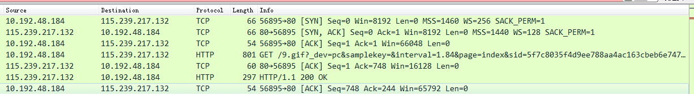

[TOC]

# 三次握手

ACK ： TCP协议规定，只有ACK=1时有效，也规定连接建立后所有发送的报文的ACK必须为1

SYN(SYNchronization) ： 在连接建立时用来同步序号。当SYN=1而ACK=0时，表明这是一个连接请求报文。对方若同意建立连接，则应在响应报文中使SYN=1和ACK=1. 因此,  SYN置1就表示这是一个连接请求或连接接受报文。

首先Client发出请求连接即 SYN=1 ACK=0 seq=x(这里是0)

Server 进行回复确认，即 SYN=1 ACK=1 seq=y(0), ack=x+1(1)

 Client 再进行一次确认，但不用SYN 了，这时即为 ACK=1, seq=x+1(1), ack=y+1(1).这次确认中seq为x+1，而不是上次握手的ack加1
